# MCP-Forge Technical Architecture Document

**Version:** 1.1.0  
**Date:** January 2026  
**Author:** Architecture Team  
**Status:** Draft for Review

---

## 1. Executive Summary

MCP-Forge is a command-line pipeline that transforms any Model Context Protocol (MCP) server—or compatible tool specification—into a specialized, locally-runnable language model packaged as a distributable **Agent Bundle**. The system inspects tool schemas, synthesizes high-quality training data with rigorous quality controls, fine-tunes quantized models, validates them against real tool execution, and packages everything for deployment.

### North Star

Given a toolset (MCP or non-MCP), MCP-Forge reliably outputs a **packaged, locally-runnable model** that:

1. **Calls the right tool(s) at the right time** with high accuracy
2. Produces **schema-valid arguments** that pass JSON Schema validation
3. Handles **tool errors and edge cases** gracefully
4. Maintains strong "normal assistant" behavior (doesn't over-call tools)
5. Can be distributed as a **self-contained Agent Bundle** (GGUF + metadata + tool spec + test suite)

### Key Architectural Decisions

| Decision | Choice | Rationale |
|----------|--------|-----------|
| Primary Interface | CLI (Click-based) | Scriptable, CI/CD friendly, lower complexity than web UI |
| Data Synthesis | Hybrid: GPT-4o seeds + Unsloth SyntheticDataKit | Quality from cloud, scale from local, ~$0.50-2 total cost |
| Data Quality | Mandatory QA gate with schema validation | Prevents bad samples from poisoning training |
| Model Families | DeepSeek-R1-Distill-8B, Qwen-2.5-14B | Reasoning + general-purpose coverage |
| Training Framework | Unsloth + LoRA | 2x faster, 70% less VRAM than standard fine-tuning |
| Validation | Looped validation against real/stubbed MCP server | Catches failures that static validation misses |
| Export Formats | GGUF Q8_0 and Q4_K_M | Balance of quality and size for deployment |
| Distribution | Agent Bundle with manifest + Modelfile | Self-contained, ready to deploy |
| Tool Sources | MCP-first, with adapters for OpenAI/file-based specs | Extensible without coupling to specific frameworks |

### Success Metrics (measured during `validate` / `benchmark`)

| Metric | Target | Description |
|--------|--------|-------------|
| Tool-call validity rate | ≥98% | % outputs that parse into tool calls |
| Schema conformance rate | ≥95% | % tool arguments passing JSON Schema validation |
| Tool selection accuracy | ≥90% | % prompts where correct tool is chosen |
| No-tool correctness | ≥85% | % prompts where *no tool* is correctly chosen |
| Robustness score | ≥80% | % of error-case prompts handled gracefully |
| Loop completion rate | ≥95% | % of validation runs completing the full tool loop |

### Assumptions

- Target hardware: NVIDIA RTX 3090 (24GB VRAM) or equivalent
- Operating system: Linux (Ubuntu 22.04/24.04)
- Python 3.10+ with CUDA 12.x
- User has OpenAI API key for seed data generation (or provides pre-generated seeds)

---

## 2. System Context & High-Level Design

### System Context Diagram


### Container Diagram


---

## 3. Technology Stack & Rationale

### 3.1 CLI Framework: Click

**Decision:** Use Click for CLI implementation

**Alternatives Considered:**
- argparse (stdlib): More verbose, less composable
- Typer: Nice but adds Pydantic dependency complexity
- Fire: Too magic, poor help text generation

**Why Click:**
- Battle-tested, excellent documentation
- Native support for command groups, options, progress bars
- Clean separation of commands without framework overhead
- Rich integration for beautiful terminal output

**Tradeoff Accepted:** Slightly more boilerplate than Typer, but fewer dependencies and more explicit control.

### 3.2 Tool Provider Abstraction

**Decision:** Abstract tool sources behind `ToolProvider` interface

**Alternatives Considered:**
- MCP-only: Simpler but limits adoption
- LangChain integration: Adds heavy runtime dependency
- Full multi-framework support: Over-engineering for MVP

**Why Abstraction:**
- Keeps MCP as primary source (best-supported)
- Allows file-based import for users without MCP servers
- OpenAI function format is widely used, cheap to adapt
- Data-only adapters: no runtime dependencies

**Implementation:**
```python
class ToolProvider(Protocol):
    async def get_tools(self) -> list[ToolDefinition]: ...
    
class McpToolProvider(ToolProvider): ...      # Live MCP server
class FileToolProvider(ToolProvider): ...     # JSON/YAML file
class OpenAIFunctionProvider(ToolProvider): ... # OpenAI format adapter
```

**Tradeoff Accepted:** Slight abstraction overhead; justified by user flexibility.

### 3.3 Data Quality Gate

**Decision:** Mandatory QA validation before training

**Alternatives Considered:**
- Trust the teacher model: GPT-4o occasionally hallucinates schemas
- Post-hoc filtering: Wastes compute on bad samples
- Manual review: Doesn't scale

**Why Mandatory QA:**
- JSON Schema validation catches argument errors
- Deduplication prevents overfitting
- Coverage analysis ensures balanced tool representation
- Error/no-tool sample injection prevents "tool addiction"

**Quality Checks:**
| Check | Action on Failure |
|-------|-------------------|
| JSON parse | Drop sample |
| Tool name exists | Drop sample |
| Schema validation | Auto-repair or drop |
| Required fields present | Drop sample |
| Near-duplicate detected | Drop sample |
| Tool coverage below minimum | Generate more for that tool |

**Tradeoff Accepted:** Adds ~30s to pipeline; prevents hours of debugging bad models.

### 3.4 Looped Validation

**Decision:** Validate by executing full tool loops, not just checking output format

**Alternatives Considered:**
- Static validation only: Fast but misses execution failures
- Manual testing: Doesn't scale
- Always use live server: Breaks CI/CD

**Why Looped Validation:**
- Catches models that produce "plausible but wrong" tool calls
- Verifies error handling behavior
- Enables CI with deterministic stubs
- Measures real-world performance

**Validation Loop:**
```
1. Prompt model with test input
2. Parse tool call from output
3. Execute against MCP server (or stub)
4. Feed tool result back to model
5. Verify final response quality
6. Record pass/fail + metrics
```

**Tradeoff Accepted:** Slower than static validation; catches more real failures.

### 3.5 Agent Bundle Packaging

**Decision:** Package models as self-contained distributable bundles

**Alternatives Considered:**
- GGUF only: Missing metadata, hard to reproduce
- Docker images: Heavy, overkill for model distribution
- Custom archive format: Reinventing the wheel

**Why Agent Bundles:**
- Everything needed to run the model in one folder
- Ollama Modelfile auto-generated
- Validation results included for trust
- Versioned and reproducible

**Bundle Structure:**
```
dist/<agent_name>/
├── model.gguf              # Quantized model
├── tools.json              # Tool definitions used
├── prompt_template.json    # System prompt + format
├── agent.yaml              # Metadata manifest
├── tests/
│   └── validation.json     # Benchmark prompts + expected results
├── README.md               # Usage instructions
└── Modelfile               # Ollama-ready config
```

**Tradeoff Accepted:** Adds packaging step; dramatically improves distribution experience.

### 3.6 Training Framework: Unsloth + TRL SFTTrainer

**Decision:** Use Unsloth's FastLanguageModel with LoRA adapters

**Why Unsloth:**
- 2x faster training, 70% less VRAM than standard approach
- Native 4-bit quantization support
- Built-in chat template handling
- Direct GGUF export via `save_pretrained_gguf()`
- `add_new_tokens()` for DeepSeek `<think>` tokens
- SyntheticDataKit for local data augmentation

**Training Profiles:**
| Profile | Use Case | Settings |
|---------|----------|----------|
| `fast_dev` | Quick iteration | epochs=1, batch=4, lr=5e-4 |
| `balanced` | Default | epochs=1, batch=2, lr=2e-4 |
| `max_quality` | Production | epochs=2, batch=1, lr=1e-4 |

**OOM Recovery:**
1. Detect CUDA OOM error
2. Reduce batch size by half
3. Resume from last checkpoint
4. If still OOM, reduce sequence length
5. Warn user with recommendations

### 3.7 Base Models

| Model | VRAM (4-bit) | Use Case | Template |
|-------|--------------|----------|----------|
| DeepSeek-R1-Distill-8B | ~6GB | Reasoning-first tool use | ChatML + `<think>` |
| Qwen-2.5-14B-Instruct | ~9-10GB | High accuracy, general purpose | ChatML |

### 3.8 Export Formats

| Format | Size (8B model) | Quality | Use Case |
|--------|-----------------|---------|----------|
| Q8_0 | ~8GB | Highest | When quality is priority |
| Q4_K_M | ~4GB | Good | When size is priority |

---

## 4. Detailed Component Design

### 4.1 Module Structure

```
mcp-forge/
├── src/
│   └── mcp_forge/
│       ├── __init__.py
│       ├── cli.py                 # Click command definitions
│       ├── config.py              # Configuration management
│       ├── state.py               # Pipeline state management
│       │
│       ├── tools/                 # Tool layer
│       │   ├── __init__.py
│       │   ├── provider.py        # ToolProvider abstraction
│       │   ├── mcp_provider.py    # MCP server inspector
│       │   ├── file_provider.py   # JSON/YAML file loader
│       │   └── openai_adapter.py  # OpenAI function format adapter
│       │
│       ├── data/                  # Data layer
│       │   ├── __init__.py
│       │   ├── synthesizer.py     # Hybrid data generation
│       │   ├── synthesis_plan.py  # Scenario planning
│       │   ├── qc.py              # Quality control engine
│       │   └── formatter.py       # Chat template handling
│       │
│       ├── training/              # Training layer
│       │   ├── __init__.py
│       │   ├── trainer.py         # Unsloth training wrapper
│       │   └── profiles.py        # Training configuration profiles
│       │
│       ├── eval/                  # Evaluation layer
│       │   ├── __init__.py
│       │   ├── validator.py       # Looped validation
│       │   ├── benchmark.py       # Evaluation suite
│       │   └── stubs.py           # Deterministic MCP stubs
│       │
│       ├── export/                # Export layer
│       │   ├── __init__.py
│       │   ├── exporter.py        # GGUF conversion
│       │   └── packager.py        # Agent bundle creation
│       │
│       └── models/                # Model-specific configs
│           ├── __init__.py
│           ├── deepseek.py
│           └── qwen.py
│
├── tests/
├── pyproject.toml
└── README.md
```

### 4.2 Core Interface Definitions

```python
# tools/provider.py
from typing import Protocol

class ToolProvider(Protocol):
    """Abstract interface for tool sources."""
    
    async def get_tools(self) -> list[ToolDefinition]:
        """Fetch tool definitions from source."""
        ...
    
    async def execute_tool(
        self, 
        name: str, 
        arguments: dict
    ) -> ToolResult:
        """Execute a tool call (for validation)."""
        ...
    
    def supports_execution(self) -> bool:
        """Whether this provider can execute tools."""
        ...


# data/synthesis_plan.py
@dataclass
class SynthesisPlan:
    """Controls data generation distribution."""
    
    total_samples: int
    tool_distribution: dict[str, float]  # tool_name -> weight
    scenario_weights: ScenarioWeights
    
@dataclass
class ScenarioWeights:
    """Weights for different sample types."""
    
    standard_tool_call: float = 0.60   # Normal tool use
    no_tool_needed: float = 0.15       # Direct answer, no tool
    error_recovery: float = 0.10       # Tool returns error
    ambiguous_choice: float = 0.10     # Multiple tools could apply
    edge_case: float = 0.05            # Boundary conditions


# data/qc.py
@dataclass
class QCReport:
    """Quality control analysis results."""
    
    total_samples: int
    valid_samples: int
    dropped_samples: int
    
    schema_pass_rate: float
    dedup_rate: float
    
    tool_coverage: dict[str, int]  # tool_name -> count
    scenario_coverage: dict[str, int]
    
    issues: list[QCIssue]
    
    def passes_threshold(self) -> bool:
        return (
            self.schema_pass_rate >= 0.98 and
            all(count >= 10 for count in self.tool_coverage.values())
        )


# eval/validator.py
@dataclass
class LoopedValidationResult:
    """Results from looped validation."""
    
    passed: bool
    samples_tested: int
    
    tool_call_parse_rate: float
    schema_conformance_rate: float
    tool_selection_accuracy: float
    loop_completion_rate: float
    error_handling_rate: float
    
    failures: list[ValidationFailure]
    
    def meets_release_criteria(self) -> bool:
        return (
            self.tool_call_parse_rate >= 0.98 and
            self.schema_conformance_rate >= 0.95 and
            self.tool_selection_accuracy >= 0.90 and
            self.loop_completion_rate >= 0.95
        )


# eval/benchmark.py
@dataclass
class BenchmarkResult:
    """Full benchmark evaluation results."""
    
    model_name: str
    timestamp: str
    
    metrics: BenchmarkMetrics
    per_tool_results: dict[str, ToolMetrics]
    per_scenario_results: dict[str, ScenarioMetrics]
    
    baseline_comparison: BaselineComparison | None
    
    def to_markdown(self) -> str:
        """Generate human-readable report."""
        ...
    
    def to_json(self) -> dict:
        """Generate machine-readable report."""
        ...


# export/packager.py
@dataclass
class AgentManifest:
    """Metadata for agent bundle (agent.yaml)."""
    
    name: str
    version: str
    created_at: str
    
    base_model: str
    base_model_revision: str
    
    training_config_hash: str
    toolset_hash: str
    dataset_stats: DatasetStats
    
    validation_summary: ValidationSummary
    benchmark_summary: BenchmarkSummary | None
    
    recommended_runtime: RuntimeConfig
```

### 4.3 Data Flow: Happy Path

```mermaid
sequenceDiagram
    participant User
    participant CLI
    participant ToolProvider
    participant Synthesizer
    participant QC
    participant Trainer
    participant Validator
    participant Benchmark
    participant Packager

    User->>CLI: forge run --server "npx weather-server" --model deepseek-r1
    
    Note over CLI: Phase 1: Tool Discovery
    CLI->>ToolProvider: get_tools(McpToolProvider)
    ToolProvider-->>CLI: [ToolDefinition x 3]
    CLI->>CLI: Save tools.json
    
    Note over CLI: Phase 2: Data Synthesis
    CLI->>Synthesizer: generate(tools, SynthesisPlan)
    Synthesizer->>Synthesizer: Generate 100 seed samples (OpenAI)
    Synthesizer->>Synthesizer: Augment to 500 samples (Unsloth)
    Synthesizer->>QC: validate_batch(samples)
    
    loop For each sample
        QC->>QC: JSON parse check
        QC->>QC: Schema validation
        QC->>QC: Dedup check
    end
    
    QC-->>Synthesizer: QCReport(valid=485, dropped=15)
    Synthesizer-->>CLI: 485 validated samples
    
    Note over CLI: Phase 3: Training
    CLI->>Trainer: train(data, profile="balanced")
    Trainer->>Trainer: Load base model (4-bit)
    Trainer->>Trainer: Prepare tokenizer + custom tokens
    Trainer->>Trainer: LoRA fine-tuning
    Trainer-->>CLI: Path to LoRA adapter
    
    Note over CLI: Phase 4: Validation
    CLI->>Validator: validate_looped(model, tools, server)
    
    loop For each test prompt
        Validator->>Validator: Generate with model
        Validator->>Validator: Parse tool call
        Validator->>ToolProvider: execute_tool(name, args)
        ToolProvider-->>Validator: ToolResult
        Validator->>Validator: Feed result to model
        Validator->>Validator: Check final response
    end
    
    Validator-->>CLI: LoopedValidationResult(passed=true)
    
    Note over CLI: Phase 5: Export & Package
    CLI->>CLI: export_gguf(adapter, "q8_0")
    CLI->>Benchmark: run_evaluation(model)
    Benchmark-->>CLI: BenchmarkResult
    CLI->>Packager: create_bundle(model, tools, results)
    Packager-->>CLI: dist/weather-expert/
    
    CLI-->>User: ✓ Agent bundle ready at dist/weather-expert/
```



### 4.4 Sequence Diagram: Looped Validation


### 4.5 Data Synthesis: Scenario-Based Generation


---

## 5. Data Architecture

### 5.1 Entity Relationships


### 5.2 Data Storage Strategy

| Data Type | Location | Format | Retention |
|-----------|----------|--------|-----------|
| Pipeline State | `.mcp-forge/state.json` | JSON | Until explicitly cleared |
| Tool Schemas | `.mcp-forge/tools.json` | JSON | Per session |
| Synthesis Plan | `.mcp-forge/synthesis_plan.json` | JSON | Per session |
| Raw Seed Data | `.mcp-forge/data/seed_raw.jsonl` | JSONL | Per session |
| Validated Training Data | `.mcp-forge/data/train.jsonl` | JSONL | Per session |
| QC Reports | `.mcp-forge/reports/qc_*.json` | JSON | 30 days |
| LoRA Adapters | `./output/lora/` | SafeTensors | Permanent |
| GGUF Models | `./output/` | GGUF | Permanent |
| Agent Bundles | `./dist/<name>/` | Directory | Permanent |
| Benchmark Results | `.mcp-forge/reports/benchmark_*.json` | JSON | Permanent |
| Training Logs | `.mcp-forge/logs/` | Text | 7 days |

### 5.3 Training Data Schema (JSONL)

```json
{
  "id": "sample_001",
  "source": "seed",
  "scenario": "standard",
  "tool_name": "get_weather",
  "qc_passed": true,
  "messages": [
    {
      "role": "system",
      "content": "You are a helpful assistant with access to weather tools..."
    },
    {
      "role": "user", 
      "content": "What's the weather like in Tokyo right now?"
    },
    {
      "role": "assistant",
      "content": "<think>\nThe user wants current weather for Tokyo.\nI should use the get_weather tool with location=\"Tokyo\".\n</think>\n\n```json\n{\"name\": \"get_weather\", \"arguments\": {\"location\": \"Tokyo\"}}\n```"
    },
    {
      "role": "tool",
      "name": "get_weather",
      "content": "{\"temperature\": 22, \"condition\": \"sunny\", \"humidity\": 45}"
    },
    {
      "role": "assistant",
      "content": "The weather in Tokyo is currently sunny with a temperature of 22°C and 45% humidity."
    }
  ]
}
```

### 5.4 No-Tool Sample Schema

```json
{
  "id": "sample_150",
  "source": "seed",
  "scenario": "no_tool",
  "tool_name": null,
  "qc_passed": true,
  "messages": [
    {
      "role": "system",
      "content": "You are a helpful assistant with access to weather tools..."
    },
    {
      "role": "user",
      "content": "What is the capital of France?"
    },
    {
      "role": "assistant",
      "content": "The capital of France is Paris. It's the largest city in France and serves as the country's political, economic, and cultural center."
    }
  ]
}
```

### 5.5 Error Recovery Sample Schema

```json
{
  "id": "sample_420",
  "source": "augmented",
  "scenario": "error",
  "tool_name": "get_weather",
  "qc_passed": true,
  "messages": [
    {
      "role": "system",
      "content": "You are a helpful assistant with access to weather tools..."
    },
    {
      "role": "user",
      "content": "What's the weather in Atlantis?"
    },
    {
      "role": "assistant",
      "content": "<think>\nThe user is asking about weather in Atlantis.\nI'll try the get_weather tool, but this might fail since Atlantis isn't a real location.\n</think>\n\n```json\n{\"name\": \"get_weather\", \"arguments\": {\"location\": \"Atlantis\"}}\n```"
    },
    {
      "role": "tool",
      "name": "get_weather",
      "content": "{\"error\": \"Location not found\", \"message\": \"Unable to find weather data for 'Atlantis'\"}"
    },
    {
      "role": "assistant",
      "content": "I wasn't able to find weather data for Atlantis. This might be because Atlantis is a mythological location rather than a real place. Would you like me to check the weather for a different city?"
    }
  ]
}
```

### 5.6 Agent Bundle Manifest (agent.yaml)

```yaml
name: weather-expert
version: "1.0.0"
created_at: "2026-01-15T10:30:00Z"

base_model:
  name: "DeepSeek-R1-Distill-Llama-8B"
  hf_id: "unsloth/DeepSeek-R1-Distill-Llama-8B-bnb-4bit"
  revision: "abc123"

training:
  config_hash: "sha256:def456..."
  profile: "balanced"
  epochs: 1
  final_loss: 0.089

dataset:
  total_samples: 485
  seed_samples: 98
  augmented_samples: 387
  tool_coverage:
    get_weather: 165
    get_forecast: 162
    get_alerts: 158
  scenario_coverage:
    standard: 290
    no_tool: 75
    error: 50
    ambiguous: 45
    edge: 25

toolset:
  hash: "sha256:789abc..."
  source: "mcp"
  command: "npx -y @modelcontextprotocol/server-weather"
  tools:
    - name: get_weather
      description: "Get current weather for a location"
    - name: get_forecast  
      description: "Get weather forecast for a location"
    - name: get_alerts
      description: "Get weather alerts for a location"

validation:
  passed: true
  tool_call_parse_rate: 0.98
  schema_conformance_rate: 0.96
  tool_selection_accuracy: 0.92
  loop_completion_rate: 0.96
  error_handling_rate: 0.84

benchmark:
  executed: true
  overall_score: 0.91
  comparison_to_base: "+15.3%"

runtime:
  recommended_context_length: 4096
  stop_tokens: ["</s>", "<|im_end|>"]
  temperature: 0.7
  supports_thinking: true
```

---

## 6. CLI Interface Design

### 6.1 Command Structure

```
mcp-forge
├── run             # Full pipeline (inspect → train → validate → export → pack)
├── doctor          # Environment check (CUDA, VRAM, dependencies)
│
├── tools           # Tool management
│   ├── inspect     # Extract tools from MCP server
│   └── import      # Import from file (OpenAI format, YAML)
│
├── generate        # Create training data
├── qa              # Dataset quality analysis + cleanup
├── train           # Fine-tune model
├── validate        # Looped validation against server
├── benchmark       # Full evaluation suite
│
├── export          # Convert to GGUF
├── pack            # Create agent bundle
├── verify-bundle   # Re-run smoke tests on bundle
│
└── status          # Show pipeline state
```

### 6.2 Command Reference

#### `forge run` - Full Pipeline

```bash
mcp-forge run \
  --server "npx -y @modelcontextprotocol/server-weather" \
  --model deepseek-r1 \
  --profile balanced \
  --samples 500 \
  --no-tool-ratio 0.15 \
  --error-ratio 0.10 \
  --format q8_0 \
  --output ./dist/weather-expert

# Options:
#   --server TEXT         MCP server command (required unless --tools-file)
#   --tools-file PATH     Import tools from file instead of MCP
#   --model [deepseek-r1|qwen-2.5]  Model family (default: deepseek-r1)
#   --profile [fast_dev|balanced|max_quality]  Training profile (default: balanced)
#   --samples INT         Total samples to generate (default: 500)
#   --no-tool-ratio FLOAT Ratio of no-tool samples (default: 0.15)
#   --error-ratio FLOAT   Ratio of error-case samples (default: 0.10)
#   --format [q8_0|q4_k_m] GGUF quantization (default: q8_0)
#   --output PATH         Output directory for bundle
#   --resume              Resume from last checkpoint
#   --skip-benchmark      Skip benchmark step
```

#### `forge doctor` - Environment Check

```bash
mcp-forge doctor

# Output:
# ✓ Python 3.10.12
# ✓ CUDA 12.1 available
# ✓ GPU: NVIDIA RTX 3090 (24GB)
# ✓ Available VRAM: 22.1GB
# ✓ Disk space: 156GB free
# ✓ unsloth 2024.1.0
# ✓ torch 2.1.0+cu121
# ⚠ OpenAI API key not set (required for seed generation)
#
# Ready to train: deepseek-r1 (6GB), qwen-2.5 (10GB)
```

#### `forge tools inspect` - MCP Inspection

```bash
mcp-forge tools inspect \
  --server "npx -y @modelcontextprotocol/server-weather" \
  --output tools.json

# Output:
# 🔍 Connecting to MCP server...
# ✓ Found 3 tools:
#   
#   get_weather
#     Get current weather conditions for a location
#     Parameters: location* (string)
#   
#   get_forecast
#     Get weather forecast for the next N days
#     Parameters: location* (string), days (integer)
#   
#   get_alerts
#     Get active weather alerts for a location
#     Parameters: location* (string)
#
# ✓ Saved to tools.json
```

#### `forge tools import` - File Import

```bash
# From OpenAI function format
mcp-forge tools import \
  --from openai-functions.json \
  --output tools.json

# From YAML
mcp-forge tools import \
  --from tools.yaml \
  --output tools.json
```

#### `forge qa` - Dataset Quality Analysis

```bash
mcp-forge qa \
  --data .mcp-forge/data/train.jsonl \
  --tools tools.json \
  --fix  # Auto-repair and rewrite

# Output:
# 📊 Dataset Quality Report
# ═══════════════════════════════════════════
# 
# Samples analyzed: 500
# Valid samples: 485 (97.0%)
# Dropped: 15
#   - Schema violations: 8
#   - Duplicates: 5
#   - Missing required fields: 2
#
# Schema Pass Rate: 98.4% ✓ (threshold: 98%)
# Dedup Rate: 1.0%
#
# Tool Coverage:
#   get_weather:  165 samples ✓
#   get_forecast: 162 samples ✓
#   get_alerts:   158 samples ✓
#
# Scenario Coverage:
#   standard:   290 (60%) ✓
#   no_tool:     75 (15%) ✓
#   error:       50 (10%) ✓
#   ambiguous:   45 (9%) ✓
#   edge:        25 (5%) ✓
#
# ✓ Dataset passes quality gate
# ✓ Cleaned dataset saved to train_clean.jsonl
```

#### `forge validate` - Looped Validation

```bash
mcp-forge validate \
  --model ./output/lora \
  --server "npx -y @modelcontextprotocol/server-weather" \
  --samples 20

# Or with deterministic stubs for CI:
mcp-forge validate \
  --model ./output/lora \
  --stub weather \
  --samples 20

# Output:
# 🔄 Running looped validation...
# 
# Test 1/20: "What's the weather in Paris?"
#   ✓ Tool call parsed
#   ✓ Schema valid
#   ✓ Executed successfully
#   ✓ Response quality OK
#
# ... (more tests)
#
# ═══════════════════════════════════════════
# Validation Results
# ═══════════════════════════════════════════
# 
# Tool Call Parse Rate:     98.0% ✓ (threshold: 98%)
# Schema Conformance:       95.0% ✓ (threshold: 95%)
# Tool Selection Accuracy:  90.0% ✓ (threshold: 90%)
# Loop Completion Rate:     95.0% ✓ (threshold: 95%)
# Error Handling Rate:      85.0% ✓ (threshold: 80%)
#
# ✓ Model passes release criteria
```

#### `forge benchmark` - Evaluation Suite

```bash
mcp-forge benchmark \
  --model ./output/lora \
  --tools tools.json \
  --baseline base-model  # Optional comparison

# Output:
# 📈 Running benchmark suite...
#
# Per-Tool Results:
# ┌─────────────┬──────────┬──────────┬──────────┐
# │ Tool        │ Accuracy │ Schema   │ Latency  │
# ├─────────────┼──────────┼──────────┼──────────┤
# │ get_weather │ 94%      │ 98%      │ 1.2s     │
# │ get_forecast│ 91%      │ 96%      │ 1.4s     │
# │ get_alerts  │ 89%      │ 97%      │ 1.3s     │
# └─────────────┴──────────┴──────────┴──────────┘
#
# Per-Scenario Results:
# ┌─────────────┬──────────┐
# │ Scenario    │ Pass Rate│
# ├─────────────┼──────────┤
# │ standard    │ 92%      │
# │ no_tool     │ 87%      │
# │ error       │ 84%      │
# │ ambiguous   │ 78%      │
# │ edge        │ 71%      │
# └─────────────┴──────────┘
#
# Overall Score: 91.2%
# vs Baseline: +15.3%
#
# ✓ Reports saved:
#   .mcp-forge/reports/benchmark_20260115.json
#   .mcp-forge/reports/benchmark_20260115.md
```

#### `forge pack` - Bundle Creation

```bash
mcp-forge pack \
  --model ./output/weather-expert.gguf \
  --tools tools.json \
  --validation .mcp-forge/reports/validation.json \
  --benchmark .mcp-forge/reports/benchmark.json \
  --output ./dist/weather-expert

# Output:
# 📦 Creating agent bundle...
#
# ✓ Model: weather-expert.gguf (4.2GB)
# ✓ Tools: 3 tools from tools.json
# ✓ Validation: passed (95% loop completion)
# ✓ Benchmark: 91.2% overall score
#
# Bundle contents:
#   dist/weather-expert/
#   ├── model.gguf (4.2GB)
#   ├── tools.json
#   ├── prompt_template.json
#   ├── agent.yaml
#   ├── tests/validation.json
#   ├── README.md
#   └── Modelfile
#
# ✓ Bundle ready at: dist/weather-expert/
#
# To deploy with Ollama:
#   cd dist/weather-expert
#   ollama create weather-expert -f Modelfile
#   ollama run weather-expert
```

#### `forge verify-bundle` - Bundle Verification

```bash
mcp-forge verify-bundle ./dist/weather-expert

# Output:
# 🔍 Verifying agent bundle...
#
# ✓ Manifest valid (agent.yaml)
# ✓ Model file exists (4.2GB)
# ✓ Tools schema valid
# ✓ Prompt template valid
#
# Running smoke tests...
# ✓ 5/5 validation tests passed
#
# ✓ Bundle verified and ready for deployment
```

### 6.3 Example Full Workflow

```bash
# 1. Check environment
mcp-forge doctor

# 2. Run full pipeline
mcp-forge run \
  --server "npx -y @modelcontextprotocol/server-weather" \
  --model deepseek-r1 \
  --profile balanced \
  --output ./dist/weather-expert

# 3. (Optional) Run additional benchmarks
mcp-forge benchmark \
  --model ./dist/weather-expert/model.gguf \
  --tools ./dist/weather-expert/tools.json

# 4. Deploy
cd ./dist/weather-expert
ollama create weather-expert -f Modelfile
ollama run weather-expert
```

---

## 7. Non-Functional Requirements

### 7.1 Scalability

| Aspect | Current Design | Target | Strategy |
|--------|----------------|--------|----------|
| Training samples | 500-1000 | <10K | Batch processing, streaming QC |
| Model size | 8B-14B params | Up to 20B | 4-bit quant, gradient checkpointing |
| VRAM usage | 10-16GB | <24GB | Unsloth 70% reduction, auto batch adjustment |
| Training time | 15-30 min | <1 hour | Acceptable for CLI batch |
| Validation samples | 20-50 | <100 | Parallel execution with stubs |

### 7.2 Reliability

| Metric | Target | Strategy |
|--------|--------|----------|
| RPO | 0 | Checkpoint after each pipeline stage |
| RTO | <5 min | Resume from last checkpoint |
| Pipeline success rate | >95% | QC gates, retry logic, OOM recovery |
| Bundle success rate | >99% | Validation gates before packaging |

**OOM Recovery Flow:**


### 7.3 Security

| Layer | Mechanism |
|-------|-----------|
| API Key Storage | Environment variable, never logged, redacted in errors |
| MCP Server Execution | User-provided command, subprocess isolation, timeout enforcement |
| Model Artifacts | Local filesystem only, no upload without explicit action |
| Bundle Distribution | Hash verification in manifest, optional signing |
| Secrets in Logs | Automatic redaction via log filtering |

### 7.4 Observability

**Logging Levels:**
- `DEBUG`: Full API responses, sample contents
- `INFO`: Progress, stage transitions, metrics
- `WARNING`: QC issues, auto-recovery actions
- `ERROR`: Failures, validation failures

**Metrics Tracked:**
| Metric | When Collected | Purpose |
|--------|----------------|---------|
| Samples generated/dropped | Synthesis | QC health |
| Schema pass rate | QC | Data quality |
| Training loss curve | Training | Model health |
| Validation pass rates | Validation | Model quality |
| Benchmark scores | Benchmark | Comparative analysis |
| VRAM usage | Training | Resource monitoring |
| Stage timing | All | Performance tracking |

**Output Files:**
| File | Format | Purpose |
|------|--------|---------|
| `.mcp-forge/logs/pipeline.log` | Text | Debug information |
| `.mcp-forge/reports/qc_*.json` | JSON | QC analysis |
| `.mcp-forge/reports/validation_*.json` | JSON | Validation results |
| `.mcp-forge/reports/benchmark_*.json` | JSON | Machine-readable metrics |
| `.mcp-forge/reports/benchmark_*.md` | Markdown | Human-readable report |

---

## 8. Risk Assessment

| Risk | Likelihood | Impact | Mitigation Strategy |
|------|------------|--------|---------------------|
| DeepSeek `<think>` tokens lost during training | High | High | `add_new_tokens()` before PEFT, validate in QC |
| Synthetic data collapse (repetitive patterns) | Medium | High | Stratified generation, diversity scoring, dedup |
| "Tool addiction" (over-calling tools) | Medium | High | 15% no-tool samples, benchmark scoring |
| VRAM OOM during training | Medium | Medium | Auto batch reduction, checkpoint-resume |
| MCP server hangs/crashes | Medium | Low | 30s timeout, clean termination, stubs for CI |
| Schema drift between train/deploy | Low | High | Hash toolset in manifest, verify-bundle check |
| Bad samples pass QC | Low | Medium | Multi-layer validation, benchmark catches |

### Risk Detail: Tool Addiction

**Why this matters:** Models fine-tuned only on tool-use examples may call tools even when direct answers are better, degrading user experience.

**Early warning:** Benchmark shows low no-tool correctness score (<80%).

**Mitigation:**
1. Include 15% no-tool samples in training data
2. Validate no-tool behavior in looped validation
3. Benchmark includes no-tool scenario scoring
4. Document expected no-tool behavior in bundle README

**Contingency:** If no-tool performance is low, regenerate data with higher no-tool ratio and retrain.

### Risk Detail: Schema Drift

**Why this matters:** If the MCP server's tool schema changes after training, the model may produce invalid arguments.

**Early warning:** `verify-bundle` fails after server update.

**Mitigation:**
1. Store toolset hash in agent.yaml
2. `verify-bundle` checks current server against stored hash
3. Document tool versions in bundle
4. Recommend retraining on schema changes

**Contingency:** Provide migration guide for retraining on updated schemas.

---

## 9. Development Roadmap

### v1.1 (Current - P0 Complete)

- [x] CLI framework with Click
- [x] State management with checkpointing
- [x] MCP inspector module
- [ ] **Dataset QA gate + schema validation**
- [ ] **No-tool + error-case sample injection**
- [ ] **Scenario-based synthesis planning**
- [ ] **Looped validation with real tool execution**
- [ ] **Basic benchmark report**

### v1.2 (P1)

- [ ] ToolProvider abstraction
- [ ] File-based tool import (JSON/YAML)
- [ ] OpenAI function format adapter
- [ ] Agent bundle packaging (`pack` command)
- [ ] Deterministic tool stubs for CI
- [ ] `verify-bundle` command

### v1.3 (P2)

- [ ] Multi-tool chain samples (optional `--agentic-mode`)
- [ ] Optional judge scoring with local model
- [ ] Template registry expansion (more model families)
- [ ] GLM-4 support
- [ ] Baseline comparison tracking

---

## 10. Appendix: Configuration Reference

### Default Configuration

```python
DEFAULT_CONFIG = {
    "synthesis": {
        "total_samples": 500,
        "seed_samples": 100,
        "augmented_samples": 400,
        "openai_model": "gpt-4o",
        "temperature_range": (0.5, 0.9),
        "max_retries": 3,
        "scenario_weights": {
            "standard": 0.60,
            "no_tool": 0.15,
            "error": 0.10,
            "ambiguous": 0.10,
            "edge": 0.05
        }
    },
    "qc": {
        "schema_pass_threshold": 0.98,
        "min_samples_per_tool": 10,
        "dedup_similarity_threshold": 0.95,
        "require_scenario_coverage": True
    },
    "training": {
        "profiles": {
            "fast_dev": {
                "max_seq_length": 2048,
                "lora_rank": 8,
                "batch_size": 4,
                "gradient_accumulation_steps": 2,
                "learning_rate": 5e-4,
                "num_epochs": 1,
                "warmup_steps": 5
            },
            "balanced": {
                "max_seq_length": 4096,
                "lora_rank": 16,
                "batch_size": 2,
                "gradient_accumulation_steps": 4,
                "learning_rate": 2e-4,
                "num_epochs": 1,
                "warmup_steps": 10
            },
            "max_quality": {
                "max_seq_length": 4096,
                "lora_rank": 32,
                "batch_size": 1,
                "gradient_accumulation_steps": 8,
                "learning_rate": 1e-4,
                "num_epochs": 2,
                "warmup_steps": 20
            }
        },
        "use_gradient_checkpointing": "unsloth",
        "oom_recovery_enabled": True
    },
    "validation": {
        "num_samples": 20,
        "thresholds": {
            "tool_call_parse_rate": 0.98,
            "schema_conformance_rate": 0.95,
            "tool_selection_accuracy": 0.90,
            "loop_completion_rate": 0.95,
            "error_handling_rate": 0.80
        },
        "timeout_seconds": 30,
        "require_thinking_tags": True  # For DeepSeek only
    },
    "benchmark": {
        "samples_per_tool": 10,
        "samples_per_scenario": 10,
        "include_latency": True,
        "judge_scoring": False  # v1.3
    },
    "export": {
        "default_format": "q8_0",
        "supported_formats": ["q8_0", "q4_k_m"]
    },
    "bundle": {
        "include_readme": True,
        "include_modelfile": True,
        "include_tests": True
    }
}
```

### Environment Variables

| Variable | Required | Description |
|----------|----------|-------------|
| `OPENAI_API_KEY` | Yes* | API key for seed generation (*or provide seed file) |
| `HF_TOKEN` | No | Hugging Face token for gated models |
| `MCP_FORGE_CONFIG` | No | Path to custom config file |
| `MCP_FORGE_CACHE_DIR` | No | Cache directory (default: `~/.cache/mcp-forge`) |
| `CUDA_VISIBLE_DEVICES` | No | GPU selection for training |

---

## 11. Revision History

| Version | Date | Author | Changes |
|---------|------|--------|---------|
| 1.0.0 | Jan 2026 | Architecture Team | Initial MVP specification |
| 1.1.0 | Jan 2026 | Architecture Team | Added QC gate, looped validation, benchmark suite, agent bundles, tool provider abstraction, scenario-based synthesis |
